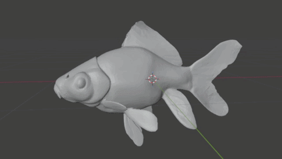
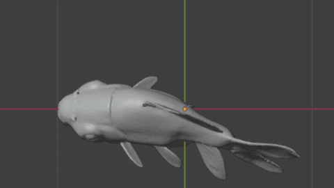

# Skeleton-Based Procedural Fish Animation




## Overview

This project demonstrates a minimal implementation of **skeleton-based procedural animation** using Blender and Python. A rigged fish model is animated by programmatically controlling its armature (bone hierarchy) through a sinusoidal wave function.

The animation is not keyframed manually. Instead, motion is generated procedurally by applying time-varying rotations across a chain of spine bones, producing a natural swimming effect.

## Features

* Skeleton-based animation using an armature (bone hierarchy)
* Procedural motion driven entirely by Python (no manual keyframes)
* Wave propagation along the spine using phase offsets
* Simple, reproducible setup using Blender scripting

## Approach

The fish is rigged with a chain of bones forming its spine. At each frame:

* A sine function is evaluated based on time
* Each bone receives a rotation offset with a phase shift relative to its position in the chain
* The amplitude increases progressively toward the tail

This creates a traveling wave along the body, mimicking real fish movement. The animation is applied in real time using Blender’s Python API by updating bone rotations per frame.

## Project Structure

```
├── assets/
│   ├── goldfish_mesh.glb     # Original mesh used for rigging
│   ├── animation.gif              # Short preview of the animation
│   └── Project_demo.mkv      # Full demo video
├── animate.py                # Procedural animation script
├── fish.blend               # Main Blender file (rigged + ready to run)
├── LICENSE                  # License file
└── README.md                # Project documentation
```
## How to Use

1. Open `fish.blend` using Blender.
2. The file will open in the **Scripting workspace**.
3. Locate the provided animation script.
4. Click **Run Script**.
5. Press **Spacebar** to play the animation.
   
**Note:** A full demonstration of the procedural animation can be found in [`Project_demo.mkv`](assets/Project_demo.mkv).

The fish will begin moving using the procedural animation logic.

## Requirements

* Blender (version 3.x or later recommended)

## Notes

* The animation is fully procedural and does not rely on pre-baked keyframes.
* A simplified mesh is used to ensure stable deformation and clear visualization of skeletal motion.
* The focus of this project is on animation logic and rig interaction rather than visual realism.

## Future Improvements

* Automated pipeline for a wide variety of fish models
* More advanced swimming models (e.g., fluid-driven motion)
* Tighter integration with python based backend
* Real-time control parameters for interactive animation
* Better import system for Game Engines like Unity and Unreal
* Possible research direction: A research study to validate the animation direction

## Summary

This project provides a concise demonstration of how procedural techniques can be combined with skeletal animation systems to produce natural motion, highlighting core concepts such as hierarchical transformations and time-based motion functions.

